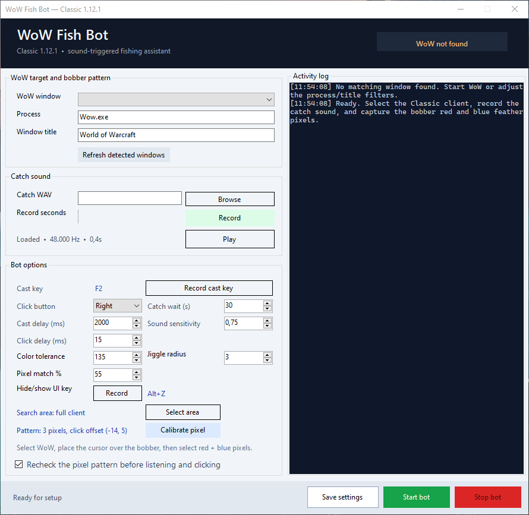
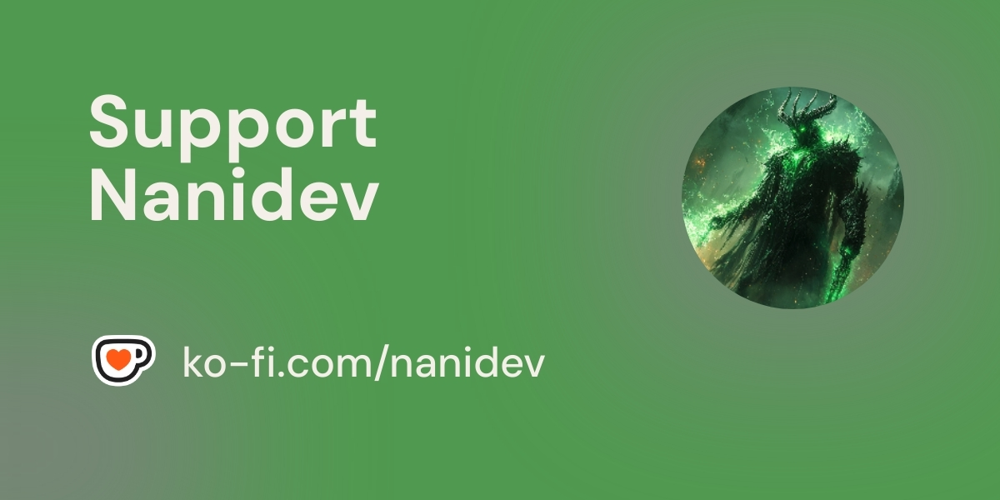

# wowfishbot

WoW Fish Bot is a configurable Windows desktop automation tool for World of Warcraft fishing. It combines sound-triggered catch detection, bobber recognition, and customizable timing controls to help streamline fishing in both classic and newer WoW versions. The app includes Interact With Target mode for modern clients, bobber pattern calibration, optional bobber validation, selectable search areas, pixel tolerance settings, custom cast and click inputs, and saved settings for repeat use. It also supports catch sound recording, built-in logs, optional UI hide/show hotkeys, and an emergency stop with ESC, making it a practical and easy-to-configure fishing assistant for players who want a reliable automated workflow.

   

[🐛 Report Bug](https://github.com/nanidev/wowfishbot/issues) · [✨ Request Feature](https://github.com/nanidev/wowfishbot/issues)

### [❤️ Donate](https://ko-fi.com/nanidev)

---

⚠️ IMPORTANT: This project, WowfishBot, is developed strictly for educational and research purposes. It is not intended for commercial use, and the user assumes all risk when utilizing it. Please use it responsibly and ethically.

## 📋 Table of Contents

- [✨ Features](#features)
- [📝 Changelog](#changelog)
- [✅ Supported World of Warcraft Clients](#Supported-World-of-Warcraft-Clients)
- [📋 Prerequisites](#Prerequisites)
- [🚀 Setup Guide](#Setup-Guide)
- [💻 Preview](#preview)
- [📄 License](#license)

## ✨ Features

- ✅ **Sound-triggered automation**
- ✅ **Support for newer WoW versions**
- ✅ **Classic mode support**
- ✅ **Interact With Target mode**
- ✅ **Configurable cast, click, and performance delays**
- ✅ **Bobber pattern calibration**
- ✅ **Optional bobber validation**
- ✅ **Selectable bobber search area**
- ✅ **Pixel tolerance and match settings**
- ✅ **Catch sound recording and playback**
- ✅ **Window selection and process filtering**
- ✅ **Custom cast key and click button support**
- ✅ **Optional UI hide/show hotkey**
- ✅ **Save and load settings**
- ✅ **Built-in logs and status display**
- ✅ **Emergency stop with `ESC`**

## 📝 Changelog

### `v0.3` — Desktop Experience, Calibration, and Build Improvements

This update improves reliability across different Windows and WoW setups while adding a more polished desktop experience.

#### New features
- Added a custom borderless title bar with minimize, maximize/restore, close, and window-resize support.
- Added persistent window size, position, maximized state, and log visibility settings.
- Added a compact layout option that hides the log panel for smaller screens.
- Added a scrollable options panel so all bot settings remain accessible as groups expand.
- Added a configurable performance delay to reduce unnecessary screen-capture and bobber-scan load.
- Added an optional calibration mode that allows selecting any three pixels without requiring red and blue bobber colors.
- Added a heart-shaped Ko-fi donate button to the title bar: [ko-fi.com/nanidev](https://ko-fi.com/nanidev).

#### Improvements and fixes
- Applied a cohesive dark-fantasy theme to the main window and calibration, area-selection, and key-capture dialogs.
- Improved custom title-bar dragging, resize hit testing, and window-control accessibility.
- Improved bobber calibration for DPI scaling and different Windows 11 display configurations.
- Preserved saved RGB samples while allowing more flexible calibration pixel selection.
- Improved startup and shutdown handling for persisted window and log-panel state.
- Updated project metadata and build configuration for .NET 9.
- Updated GitHub Actions builds to use Node.js 24 and .NET 9.
- Added a framework-dependent single-file `win-x64` publish artifact for Windows deployments.

### `v0.2` — Newer WoW Client Version Support

This update adds support for newer WoW clients through **Interact With Target** mode.

#### What changed
- Added **Interact With Target** mode for newer WoW versions.
- The configured cast key is used to cast and then used again after the catch sound to reel in.
- Bobber scanning and mouse clicking are skipped in this mode.
- Fixed a startup crash caused by a missing `Performance Delay` control.
- Improved build reliability by updating generated designer files for nullable context handling.

#### Important
- Classic fishing mode still works as before.
- If using a newer WoW client, enable **Interact With Target** in the app settings.

For the full history, see the [GitHub Releases](https://github.com/nanidev/wowfishbot/releases) page.

## ✅ Supported World of Warcraft Clients

- ✅ **World of Warcraft 1.12.1** — Vanilla wow (Tested and working)
- ⬜ **World of Warcraft 2.4.3** — The Burning Crusade
- ⬜ **World of Warcraft 3.3.5a** — Wrath of the Lich King
- ⬜ **World of Warcraft 4.3.4** — Cataclysm
- ⬜ **World of Warcraft 5.4.8** — Mists of Pandaria
- ⬜ **World of Warcraft 6.2.4** — Warlords of Draenor
- ⬜ **World of Warcraft 7.3.5** — Legion
- ⬜ **World of Warcraft 8.3.7** — Battle for Azeroth
- ⬜ **World of Warcraft 9.2.7** — Shadowlands
- ⬜ **World of Warcraft 10.2.7** — Dragonflight
- ⬜ **World of Warcraft 11.x** — The War Within / current retail builds

### Help Test Other Clients
Only **1.12.1** has been confirmed so far. If you test the bot on any other client version, your feedback helps improve compatibility and expand support for more World of Warcraft versions.

## Prerequisites

Before setting up the bot, make sure you have:

- **Windows PC**
- **.NET 9 runtime** or the ability to build and run the project from Visual Studio
- **World of Warcraft installed and working**
- **A compatible WoW client**
- **A working sound output device**
- **A mouse and keyboard configured normally for gameplay**
- **Administrator access**, if needed for running or debugging the app
- **A clean audio recording tool** such as **Audacity** for trimming the catch sound
- **Enough screen space and a stable UI scale** for bobber detection and calibration

It also helps to have:

- The game running in **windowed mode** or a stable full-screen setup
- A quiet environment for recording the catch sound
- The correct WoW window selected before starting the bot

## 🚀 Setup Guide

This guide walks through the basic setup for the bot and how to get it ready for use.

## 1. Prepare the Bot

Before starting, make sure you have:

- A compatible **World of Warcraft client**
- A working **sound device** for recording and playback
- A clean game window with the correct resolution and UI scale
- The bot built and launched successfully

If you are using a newer WoW client, enable **Interact With Target** mode later in the settings.  
If you are using the tested classic client, use the standard classic workflow.

---

## 2. Launch the Application

1. Open the bot.
2. Make sure the main window loads correctly.
3. Confirm that the status area shows the app is ready.
4. If the app does not start correctly, rebuild the project and try again.

---

## 3. Select the Correct WoW Window

The bot needs to know which game window to use.

1. Open World of Warcraft.
2. In the bot, select the correct WoW window from the window list.
3. If the window does not appear, check:
   - the game is running
   - the process name filter is correct
   - the window is not minimized or hidden

---

## 4. Record the Catch Sound

The catch sound is one of the most important parts of the setup.  
The bot listens for this sound to know when the fish has been caught.

### How to Record It
1. In the bot, use the recording feature to capture the fish catch sound.
2. Cast a line in game and let the audio recorder capture the full sound.
3. Save the recording.

### Trim the Recording
It is best to trim the recording so it contains only the actual **fish catch sound** and nothing extra.

A good program for this is **Audacity**:
- it is free
- easy to use
- good for trimming and cleaning short audio clips

### In Audacity
1. Open the recorded sound file.
2. Find the section that contains only the catch sound.
3. Remove:
   - silence before the sound
   - extra background noise
   - any sound after the catch effect
4. Export the trimmed file as a clean `.wav` file.

### Tips
- Keep the file short and precise.
- Avoid long silence at the beginning.
- Avoid recording system sounds or microphone noise.
- Use a clean WAV file for best results.

---

## 5. Calibrate the Bobber Pattern

The bot uses a bobber pattern to detect the fishing float on screen.

1. Click the calibration button.
2. Capture the bobber area on the screen.
3. Select the important pixels in the bobber pattern.
4. Save the pattern.

### Best Practices
- Pick stable, visible parts of the bobber.
- Avoid selecting pixels that change often.
- Use the suggested color points carefully.
- If the bobber moves around, later enable validation if needed.

---

## 6. Set the Search Area

To improve accuracy, narrow the scan region to where the bobber usually appears.

1. Open the search area selector.
2. Drag out a rectangle around the fishing area.
3. Save the region.

This helps:
- reduce false detections
- improve speed
- lower CPU usage

---

## 7. Configure the Main Settings

Adjust the key settings before running the bot.

### Cast Delay
Delay after casting before the bot starts scanning.

### Click Delay
Delay before clicking after a catch is detected.

### Performance Delay
Pause between scans and actions to reduce CPU load.

### Timeout
How long the bot listens for a catch before stopping the current attempt.

### Pixel Tolerance
Controls how much color difference is accepted in bobber detection.

### Match Score
Controls how many calibrated pixels must match before detection succeeds.

### Record Seconds
How long the catch-sound recording should be.

---

## 8. Choose the Input Mode

### Classic Mode
Use this for the older, tested client.

### Interact With Target Mode
Use this for newer WoW versions.

This mode:
- uses the configured cast key
- reuses the key to reel in after the catch sound
- skips mouse clicking and bobber scanning

If you are on a newer client, this is usually the preferred mode.

---

## 9. Set Hotkeys and Inputs

Configure the inputs the bot will use:

- **Cast key**
- **Click button**
- **Hide/show UI hotkey**, if desired

Make sure the key you choose is easy to press and not already heavily used by another game action.

---

## 10. Save Your Settings

Once everything is configured:

1. Save your settings.
2. Close and reopen the app if needed.
3. Confirm the settings are loaded correctly.

This makes future launches faster and easier.

---

## 11. Test the Setup

Before using the bot normally:

1. Start in a safe area.
2. Cast once.
3. Watch whether the bot detects the bobber correctly.
4. Confirm it reacts to the catch sound.
5. Check that the timing feels correct.

If something is off, adjust:
- the catch sound recording
- bobber calibration
- delay values
- pixel tolerance
- search area

---

## 12. Troubleshooting

### The bot does not detect the catch
- Re-record the sound
- Trim the audio more tightly in Audacity
- Lower background noise
- Confirm the correct WAV file is loaded

### The bobber is not detected
- Recalibrate the bobber pattern
- Use a tighter search region
- Increase or decrease pixel tolerance
- Try a different pattern selection

### The bot reacts too slowly
- Lower performance delay
- Reduce click delay
- Make sure the PC is not under heavy load

### The bot clicks too early or too late
- Adjust cast delay
- Adjust click delay
- Recheck the audio clip timing

### The bot does not work on the client
- Try **Interact With Target** for newer versions
- Confirm the correct client is selected
- Make sure the window is focused and visible

---

## 13. Recommended First-Time Setup Order

For best results, follow this order:

1. Open the game
2. Launch the bot
3. Select the correct WoW window
4. Record and trim the catch sound
5. Calibrate the bobber pattern
6. Set the search area
7. Configure delays and thresholds
8. Save settings
9. Test once
10. Fine-tune if needed

---

## 14. Final Notes

The best setup usually comes from small adjustments rather than large changes.  
Start with the defaults, test one setting at a time, and refine the sound recording and bobber calibration until the bot behaves consistently.

For the cleanest audio results, **Audacity** is strongly recommended for trimming the catch sound down to only the exact fish catch moment.
  
## 💻 Preview

## 📄 License

Distributed under the GPL-3.0 License. See `LICENSE` for more information.

---

Made with ❤️ by nanidev

